# API Endpoints Reference

Complete documentation of all REST API endpoints with sequence diagrams showing the flow through the application architecture.

## Table of Contents

- [Architecture Overview](#architecture-overview)
- [Authentication Flow](#authentication-flow)
- [Account Endpoints](#account-endpoints)
  - [Create Account](#1-create-account)
  - [List Accounts](#2-list-accounts)
  - [Get Account](#3-get-account)
  - [Update Account](#4-update-account)
  - [Delete Account](#5-delete-account)
- [Transaction Endpoints](#transaction-endpoints)
  - [Create Transaction](#1-create-transaction)
  - [Create Batch Transactions](#2-create-batch-transactions)
  - [List Transactions](#3-list-transactions)
  - [Get Transaction](#4-get-transaction)
  - [Update Transaction](#5-update-transaction)
  - [Delete Transaction](#6-delete-transaction)

---

## Architecture Overview

All endpoints follow the same layered architecture:

```
Client → Route → Service → Repository → Database
         ↓
    Authentication
    (get_current_user)
```

**Layers:**
- **Route**: FastAPI endpoint with dependency injection (authentication, database session)
- **Service**: Business logic, validation, orchestration
- **Repository**: Data access with multi-tenant filtering
- **Database**: SQLAlchemy ORM models and PostgreSQL/SQLite

**Common Dependencies:**
- `get_current_user`: JWT authentication via MCP_Auth integration
- `get_db`: Database session management

---

## Authentication Flow

All endpoints require JWT authentication. The authentication flow is shared across all endpoints:

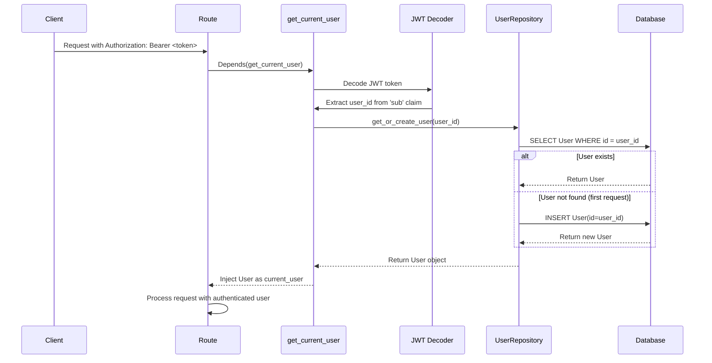

**Security Notes:**
- Invalid/expired tokens → 401 Unauthorized
- Multi-tenant isolation enforced at repository layer
- User records auto-created on first API request

---

# Account Endpoints

Base path: `/api/accounts`

## 1. Create Account

**Endpoint:** `POST /api/accounts`
**Authentication:** Required
**Request Body:** `AccountCreate`
**Response:** `AccountResponse` (201 Created)

### Sequence Diagram

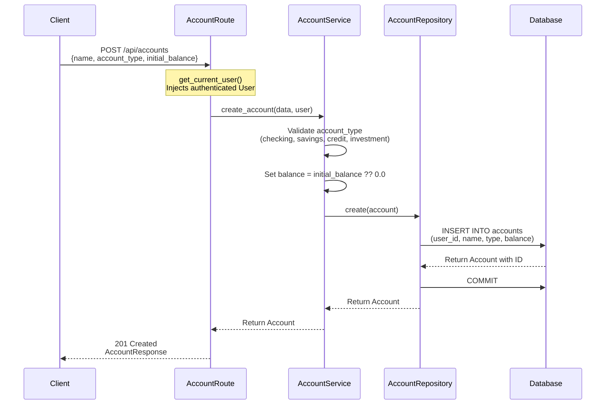

### Business Logic

1. Validates `account_type` against allowed values
2. Sets `initial_balance` to 0.0 if not provided
3. Associates account with authenticated user
4. Returns created account with generated ID

### Validation Rules

- `name`: Required, 1-255 characters
- `account_type`: Must be one of: `checking`, `savings`, `credit`, `investment`
- `initial_balance`: Optional, defaults to 0.0

---

## 2. List Accounts

**Endpoint:** `GET /api/accounts`
**Authentication:** Required
**Query Parameters:** None
**Response:** `AccountListResponse` (200 OK)

### Sequence Diagram

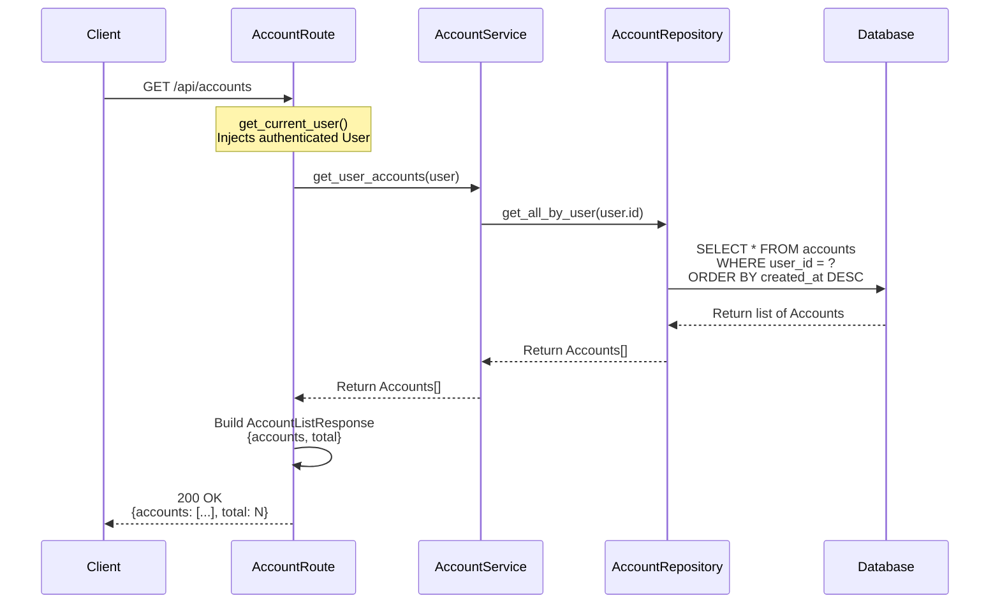

### Business Logic

1. Fetches all accounts belonging to authenticated user
2. Results ordered by creation date (newest first)
3. Returns total count for pagination/UI

### Multi-Tenant Isolation

- Repository enforces `WHERE user_id = ?` filter
- User can ONLY see their own accounts
- No cross-user data leakage possible

---

## 3. Get Account

**Endpoint:** `GET /api/accounts/{account_id}`
**Authentication:** Required
**Path Parameters:** `account_id` (integer)
**Response:** `AccountResponse` (200 OK)

### Sequence Diagram

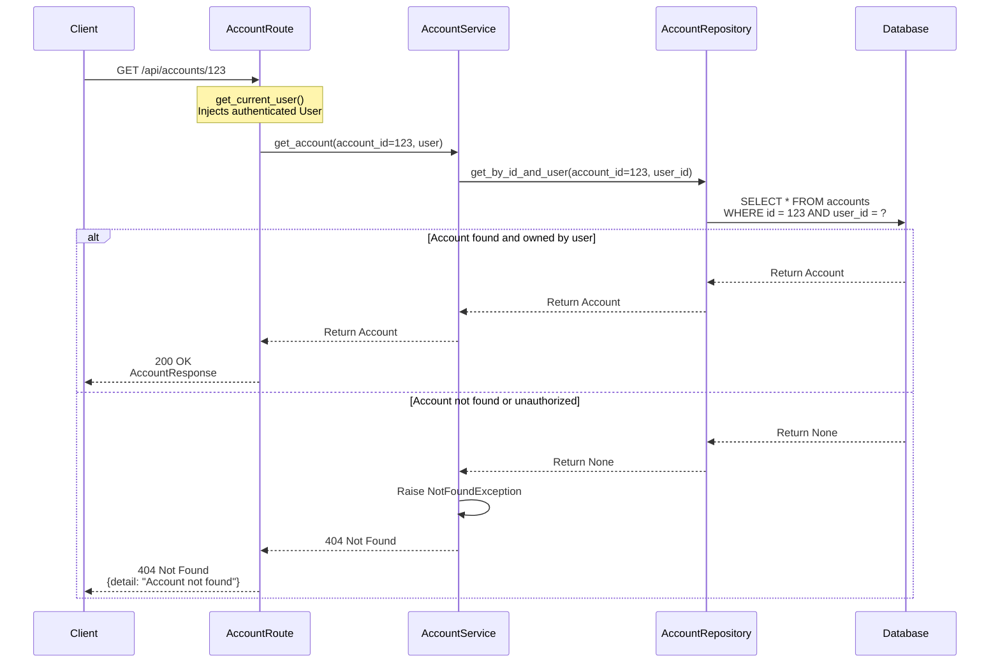

### Business Logic

1. Fetches account by ID with user ownership check
2. Returns 404 if account doesn't exist OR user doesn't own it (security)
3. Single database query with composite filter

### Security Note

Returns same error (404) whether account doesn't exist or belongs to another user. This prevents information disclosure about account IDs.

---

## 4. Update Account

**Endpoint:** `PATCH /api/accounts/{account_id}`
**Authentication:** Required
**Path Parameters:** `account_id` (integer)
**Request Body:** `AccountUpdate` (partial)
**Response:** `AccountResponse` (200 OK)

### Sequence Diagram

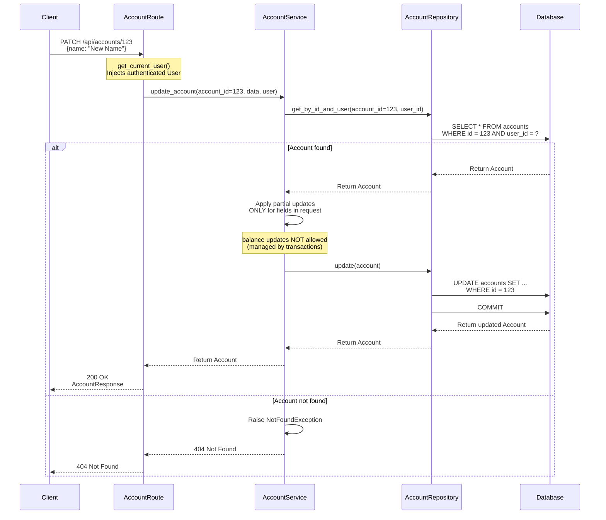

### Business Logic

1. Verifies account ownership before update
2. Applies ONLY fields present in request (partial update)
3. `balance` field is read-only (managed by transaction operations)
4. Validates `account_type` if provided

### Allowed Updates

- `name`: String, 1-255 characters
- `account_type`: Must be valid type

---

## 5. Delete Account

**Endpoint:** `DELETE /api/accounts/{account_id}`
**Authentication:** Required
**Path Parameters:** `account_id` (integer)
**Response:** 204 No Content

### Sequence Diagram

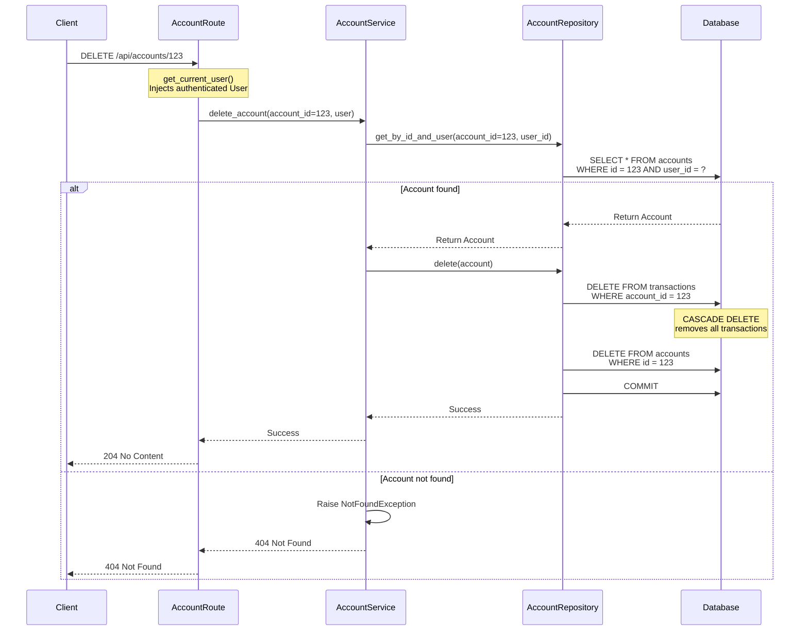

### Business Logic

1. Verifies account ownership before deletion
2. **CASCADE DELETE**: Automatically deletes all associated transactions
3. Atomic operation (single transaction)
4. Returns 204 No Content on success (no response body)

### Warning

Deletion is **permanent** and removes all transaction history for the account. Consider implementing soft deletes or archiving for production systems.

---

# Transaction Endpoints

Base path: `/api/transactions`

## 1. Create Transaction

**Endpoint:** `POST /api/transactions`
**Authentication:** Required
**Request Body:** `TransactionCreate`
**Response:** `TransactionResponse` (201 Created)

### Sequence Diagram

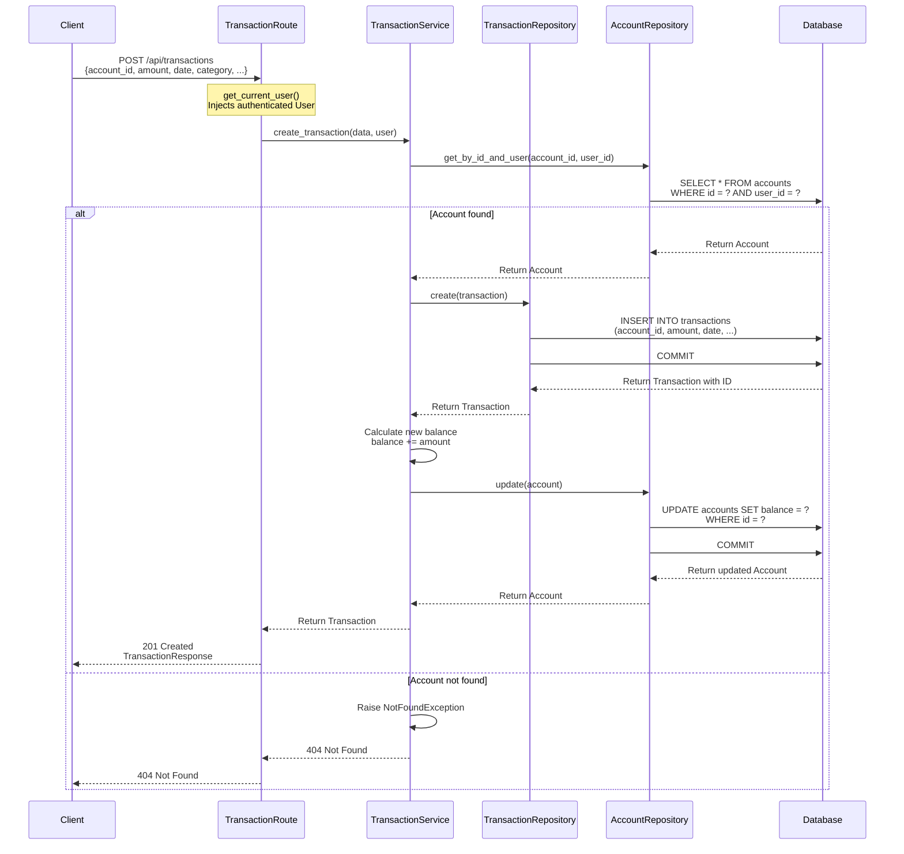

### Business Logic

1. Verifies account ownership before creating transaction
2. Creates transaction record
3. Updates account balance automatically (`balance += amount`)
4. Positive amounts = income/deposits, negative = expenses/withdrawals
5. Two separate commits (transaction, then balance update)

### Validation Rules

- `account_id`: Must exist and be owned by user
- `amount`: Required (float, positive or negative)
- `date`: Required (ISO date format)
- `category`: Required, 1-100 characters
- `description`: Optional, max 1000 characters
- `merchant`: Optional, max 255 characters
- `location`: Optional, max 255 characters
- `tags`: Optional array of strings
- `der_category`: Optional derived category, max 100 characters
- `der_merchant`: Optional derived merchant, max 255 characters

---

## 2. Create Batch Transactions

**Endpoint:** `POST /api/transactions/batch`
**Authentication:** Required
**Request Body:** `TransactionBatchCreate`
**Response:** `TransactionBatchResponse` (201 Created)

### Sequence Diagram

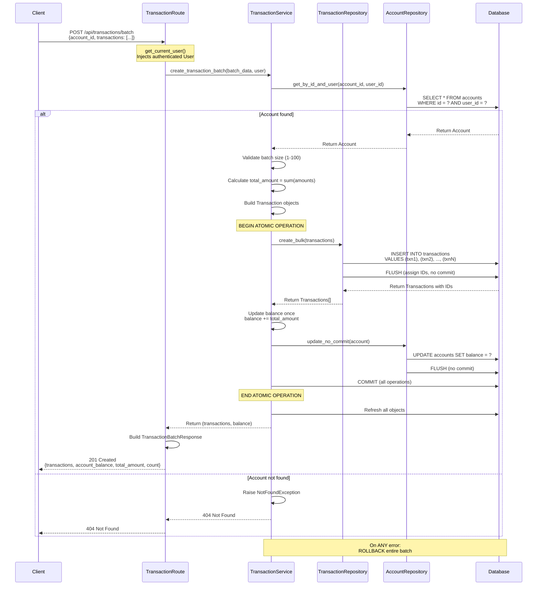

### Business Logic

1. Verifies account ownership
2. Validates batch size: minimum 1, maximum 100 transactions
3. **ATOMIC OPERATION**: All transactions committed together
4. Balance updated exactly once with `sum(amounts)`
5. Single database transaction for entire batch
6. On any failure, entire batch is rolled back (all-or-nothing)

### Validation Rules

- `account_id`: Must exist and be owned by user
- `transactions`: Array with 1-100 items (enforced by Pydantic)
- Each transaction follows same validation as single create
- All transactions share the same `account_id`

### Performance Benefits

- Bulk insert with `db.add_all()` instead of N individual inserts
- Single balance update instead of N updates
- Single database transaction instead of 2N transactions
- Significant performance improvement for large batches

### Example Request

```json
{
  "account_id": 123,
  "transactions": [
    {"amount": -50.00, "date": "2026-01-03", "category": "groceries", "merchant": "Whole Foods"},
    {"amount": -30.00, "date": "2026-01-03", "category": "gas", "merchant": "Shell"},
    {"amount": 100.00, "date": "2026-01-03", "category": "income", "description": "Freelance work"}
  ]
}
```

### Example Response

```json
{
  "transactions": [
    {"id": 1, "amount": -50.00, "category": "groceries", ...},
    {"id": 2, "amount": -30.00, "category": "gas", ...},
    {"id": 3, "amount": 100.00, "category": "income", ...}
  ],
  "account_balance": 1020.00,
  "total_amount": 20.00,
  "count": 3
}
```

---

## 3. List Transactions

**Endpoint:** `GET /api/transactions`
**Authentication:** Required
**Query Parameters:** Multiple filters (see below)
**Response:** `TransactionListResponse` (200 OK)

### Sequence Diagram

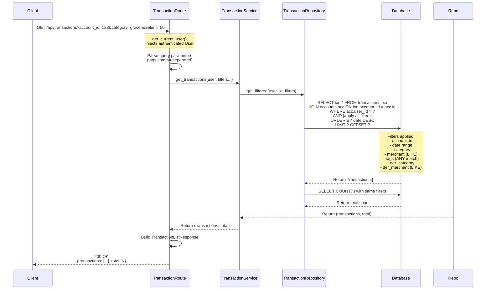

### Query Parameters

| Parameter | Type | Description | Example |
|-----------|------|-------------|---------|
| `account_id` | int | Filter by account | `?account_id=123` |
| `start_date` | date | Start date (inclusive) | `?start_date=2026-01-01` |
| `end_date` | date | End date (inclusive) | `?end_date=2026-01-31` |
| `category` | string | Exact category match | `?category=groceries` |
| `merchant` | string | Partial merchant match | `?merchant=Whole` |
| `tags` | string | Comma-separated, ANY match | `?tags=food,essential` |
| `der_category` | string | Exact derived category | `?der_category=shopping` |
| `der_merchant` | string | Partial derived merchant | `?der_merchant=amazon` |
| `limit` | int | Max results (1-1000) | `?limit=50` |
| `offset` | int | Pagination offset | `?offset=100` |

### Business Logic

1. Joins transactions with accounts to enforce user ownership
2. Applies all provided filters (AND logic)
3. Tags use ANY match (OR logic within tags)
4. Merchant/der_merchant use partial matching (LIKE)
5. Returns total count for pagination
6. Results sorted by date (newest first)

### Multi-Tenant Security

- Always joins with accounts table: `JOIN accounts ON transactions.account_id = accounts.id`
- Filters by `accounts.user_id = current_user.id`
- User can ONLY see transactions from their own accounts

---

## 4. Get Transaction

**Endpoint:** `GET /api/transactions/{transaction_id}`
**Authentication:** Required
**Path Parameters:** `transaction_id` (integer)
**Response:** `TransactionResponse` (200 OK)

### Sequence Diagram

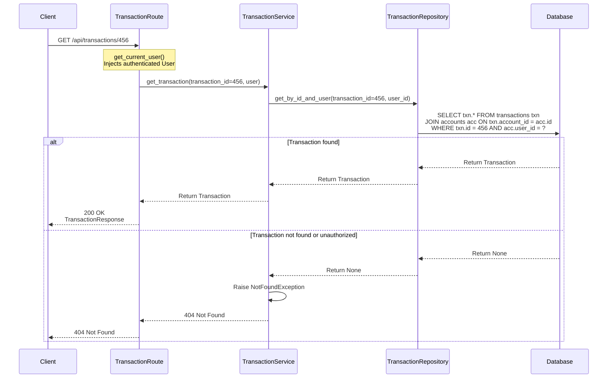

### Business Logic

1. Fetches transaction by ID with user ownership check via account join
2. Returns 404 if transaction doesn't exist OR user doesn't own the account
3. Single database query with join

### Security Note

Returns same error (404) whether transaction doesn't exist or belongs to another user's account. Prevents information disclosure.

---

## 5. Update Transaction

**Endpoint:** `PATCH /api/transactions/{transaction_id}`
**Authentication:** Required
**Path Parameters:** `transaction_id` (integer)
**Request Body:** `TransactionUpdate` (partial)
**Response:** `TransactionResponse` (200 OK)

### Sequence Diagram

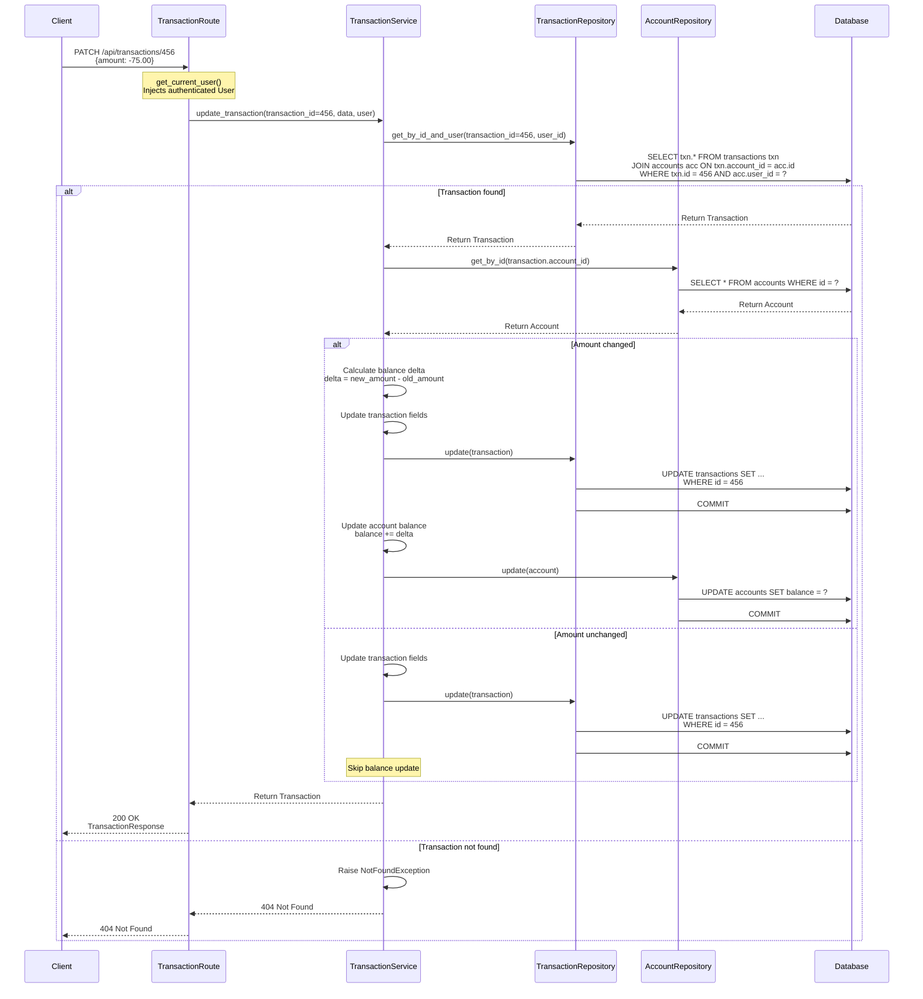

### Business Logic

1. Verifies transaction ownership via account join
2. Applies ONLY fields present in request (partial update)
3. **Smart Balance Recalculation**:
   - If `amount` changed: calculates delta and updates account balance
   - If `amount` unchanged: skips balance update for efficiency
4. Balance delta = `new_amount - old_amount`
5. Other fields (category, merchant, etc.) don't affect balance

### Allowed Updates

All fields are optional (partial update):
- `amount`: Triggers balance recalculation
- `date`, `category`, `description`, `merchant`, `location`, `tags`
- `der_category`, `der_merchant`

---

## 6. Delete Transaction

**Endpoint:** `DELETE /api/transactions/{transaction_id}`
**Authentication:** Required
**Path Parameters:** `transaction_id` (integer)
**Response:** 204 No Content

### Sequence Diagram

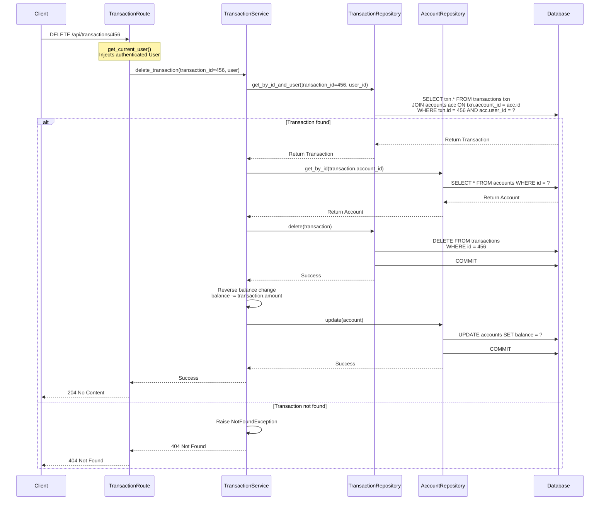

### Business Logic

1. Verifies transaction ownership via account join
2. Deletes transaction record
3. **Automatic Balance Correction**: `balance -= transaction.amount`
4. Two separate commits (transaction delete, then balance update)
5. Returns 204 No Content on success (no response body)

### Example

If deleting a transaction with `amount = -50.00` (expense):
- Balance adjustment: `balance -= (-50.00)` → balance increases by 50.00
- This reverses the original expense

---

## Error Responses

All endpoints use consistent error format:

### 401 Unauthorized
```json
{
  "detail": "Could not validate credentials"
}
```
**Cause:** Missing, invalid, or expired JWT token

### 404 Not Found
```json
{
  "detail": "Account not found"
}
```
**Cause:** Resource doesn't exist OR user doesn't have access (security)

### 422 Unprocessable Entity
```json
{
  "detail": [
    {
      "loc": ["body", "category"],
      "msg": "ensure this value has at least 1 characters",
      "type": "value_error.any_str.min_length"
    }
  ]
}
```
**Cause:** Pydantic validation failed (invalid request body)

### 400 Bad Request
```json
{
  "detail": "Batch must contain at least 1 transaction"
}
```
**Cause:** Business logic validation failed

---

## Performance Considerations

### Database Indexes

Recommended indexes for optimal query performance:

```sql
-- Multi-tenant security (critical)
CREATE INDEX idx_accounts_user_id ON accounts(user_id);
CREATE INDEX idx_transactions_account_id ON transactions(account_id);

-- Transaction filtering
CREATE INDEX idx_transactions_date ON transactions(date DESC);
CREATE INDEX idx_transactions_category ON transactions(category);
CREATE INDEX idx_transactions_merchant ON transactions(merchant);
CREATE INDEX idx_transactions_der_category ON transactions(der_category);

-- Composite for common queries
CREATE INDEX idx_transactions_account_date ON transactions(account_id, date DESC);
```

### Batch Operations

For importing large datasets:
- Use `POST /api/transactions/batch` instead of individual creates
- Maximum 100 transactions per batch
- For >100, chunk into multiple batch requests
- Performance gain: ~10-50x faster than individual inserts

### Query Optimization

- List endpoints use LIMIT/OFFSET pagination
- Default limit: 100 transactions
- Maximum limit: 1000 transactions
- Use filters to reduce result set size

---

## Testing

All endpoints have comprehensive test coverage. See `tests/test_accounts.py` and `tests/test_transactions.py`.

**Test Suite:**
- 82/82 tests passing
- Coverage includes: success cases, validation, multi-tenant security, atomicity, error handling

**Run Tests:**
```bash
pytest
pytest tests/test_accounts.py -v
pytest tests/test_transactions.py::TestBatchTransactionCreation -v
```

---

## OpenAPI Documentation

Interactive API documentation available at:
- **Swagger UI**: http://localhost:8000/docs
- **ReDoc**: http://localhost:8000/redoc

Features:
- Try-it-out functionality for all endpoints
- Request/response schema validation
- Authentication token configuration
- Example requests and responses