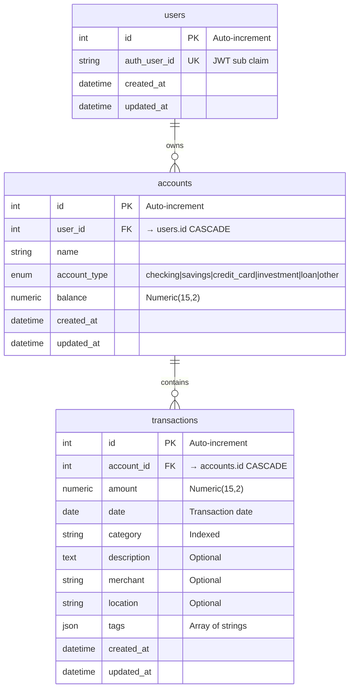

# Database Schema Documentation

Complete database schema documentation for the Finance Planner multi-tenant personal finance tracking system.

## Overview

The Finance Planner uses a relational database with three core tables designed for multi-tenant operation. All data is isolated by user, with automatic cascade deletes to maintain referential integrity.

**Technology Stack:**
- **Database**: PostgreSQL (production) or SQLite (development/testing)
- **ORM**: SQLAlchemy 2.0 with declarative mapping
- **Migrations**: Alembic
- **Multi-Tenancy**: User-scoped data with strict isolation

**Key Features:**
- Auto-timestamping on all records (created_at, updated_at)
- Cascade delete relationships (User → Accounts → Transactions)
- Financial precision with Numeric(15,2) for monetary values
- Optimized indexes for common query patterns
- Flexible tagging system using JSON

---

## Entity Relationship Diagram

### ASCII Diagram

```
┌─────────────────────────┐
│        users            │
├─────────────────────────┤
│ PK │ id                 │
│ UK │ auth_user_id       │◄────── JWT 'sub' claim from MCP_Auth
│    │ created_at         │
│    │ updated_at         │
└──────────┬──────────────┘
           │ 1
           │
           │ has many
           │
           │ N
┌──────────▼──────────────┐
│       accounts          │
├─────────────────────────┤
│ PK │ id                 │
│ FK │ user_id            │───────► users.id (CASCADE)
│ IDX│ user_id            │◄────── Multi-tenant queries
│    │ name               │
│    │ account_type       │◄────── ENUM (checking, savings, etc.)
│    │ balance            │◄────── Numeric(15,2)
│    │ created_at         │
│    │ updated_at         │
└──────────┬──────────────┘
           │ 1
           │
           │ has many
           │
           │ N
┌──────────▼──────────────┐
│     transactions        │
├─────────────────────────┤
│ PK │ id                 │
│ FK │ account_id         │───────► accounts.id (CASCADE)
│ IDX│ date               │
│ IDX│ category           │
│    │ amount             │◄────── Numeric(15,2) (+income/-expense)
│    │ description        │
│    │ merchant           │
│    │ location           │
│    │ tags               │◄────── JSON array
│    │ created_at         │
│    │ updated_at         │
└─────────────────────────┘

Composite Indexes:
  • (account_id, date)     - Date range queries per account
  • (account_id, category) - Category filtering per account
```

### Mermaid Diagram



---

## Table Specifications

### `users` Table

**Purpose:** Tracks users authenticated via MCP_Auth JWT tokens. No authentication credentials stored.

**File:** `app/models/user.py`

#### Columns

| Column | Type | Constraints | Description |
|--------|------|-------------|-------------|
| `id` | Integer | PRIMARY KEY, AUTOINCREMENT | Internal user ID |
| `auth_user_id` | String(255) | UNIQUE, NOT NULL, INDEXED | User ID from JWT 'sub' claim (from MCP_Auth) |
| `created_at` | DateTime | NOT NULL, DEFAULT now() | Record creation timestamp (from TimestampMixin) |
| `updated_at` | DateTime | NOT NULL, DEFAULT now(), ON UPDATE now() | Last update timestamp (from TimestampMixin) |

#### Relationships

| Relationship | Type | Target | Cascade | Back-Populates |
|--------------|------|--------|---------|----------------|
| `accounts` | One-to-Many | `accounts` table | `all, delete-orphan` | `account.user` |

**Cascade Behavior:** When a user is deleted, all associated accounts (and their transactions) are automatically deleted.

#### Indexes

- **PRIMARY KEY** on `id`
- **UNIQUE INDEX** on `auth_user_id` (also enables fast JWT lookups)

#### Notes

- Users are auto-created on first API request with valid JWT
- No password or email stored (delegated to MCP_Auth)
- `auth_user_id` matches the JWT 'sub' claim from MCP_Auth

---

### `accounts` Table

**Purpose:** Financial accounts owned by users (checking, savings, credit cards, investments, etc.)

**File:** `app/models/account.py`

#### Columns

| Column | Type | Constraints | Description |
|--------|------|-------------|-------------|
| `id` | Integer | PRIMARY KEY, AUTOINCREMENT | Account ID |
| `user_id` | Integer | FOREIGN KEY (users.id), NOT NULL, INDEXED | Owner's user ID (CASCADE on delete) |
| `name` | String(255) | NOT NULL | Account name (e.g., "Chase Checking") |
| `account_type` | Enum | NOT NULL | Type of account (see AccountType enum) |
| `balance` | Numeric(15,2) | NOT NULL, DEFAULT 0.00 | Current balance (auto-calculated from transactions) |
| `created_at` | DateTime | NOT NULL, DEFAULT now() | Record creation timestamp (from TimestampMixin) |
| `updated_at` | DateTime | NOT NULL, DEFAULT now(), ON UPDATE now() | Last update timestamp (from TimestampMixin) |

#### Relationships

| Relationship | Type | Target | Cascade | Back-Populates |
|--------------|------|--------|---------|----------------|
| `user` | Many-to-One | `users` table | N/A (child) | `user.accounts` |
| `transactions` | One-to-Many | `transactions` table | `all, delete-orphan` | `transaction.account` |

**Cascade Behavior:**
- When a user is deleted → all accounts deleted (via `users.accounts` cascade)
- When an account is deleted → all associated transactions deleted

#### Indexes

- **PRIMARY KEY** on `id`
- **INDEX** on `user_id` (critical for multi-tenant queries)

#### Foreign Keys

- `user_id` → `users.id` with `ON DELETE CASCADE`

#### Notes

- Balance is maintained by the transaction service (not directly modified via API)
- All queries must filter by `user_id` for multi-tenant security
- Balance precision: Up to 9,999,999,999,999.99 (13 digits + 2 decimals)

---

### `transactions` Table

**Purpose:** Financial transactions (income, expenses) linked to accounts with automatic balance updates

**File:** `app/models/transaction.py`

#### Columns

| Column | Type | Constraints | Description |
|--------|------|-------------|-------------|
| `id` | Integer | PRIMARY KEY, AUTOINCREMENT | Transaction ID |
| `account_id` | Integer | FOREIGN KEY (accounts.id), NOT NULL, INDEXED | Associated account (CASCADE on delete) |
| `amount` | Numeric(15,2) | NOT NULL | Transaction amount (positive=income, negative=expense) |
| `date` | Date | NOT NULL, INDEXED | Transaction date |
| `category` | String(100) | NOT NULL, INDEXED | Transaction category (e.g., "groceries", "salary") |
| `description` | Text | NULLABLE | Optional detailed description |
| `merchant` | String(255) | NULLABLE | Optional merchant name (e.g., "Whole Foods") |
| `location` | String(255) | NULLABLE | Optional location (e.g., "Seattle, WA") |
| `tags` | JSON | NULLABLE, DEFAULT [] | Array of string tags for flexible categorization |
| `created_at` | DateTime | NOT NULL, DEFAULT now() | Record creation timestamp (from TimestampMixin) |
| `updated_at` | DateTime | NOT NULL, DEFAULT now(), ON UPDATE now() | Last update timestamp (from TimestampMixin) |

#### Relationships

| Relationship | Type | Target | Cascade | Back-Populates |
|--------------|------|--------|---------|----------------|
| `account` | Many-to-One | `accounts` table | N/A (child) | `account.transactions` |

**Cascade Behavior:**
- When an account is deleted → all transactions deleted (via `account.transactions` cascade)

#### Indexes

**Single-Column Indexes:**
- **PRIMARY KEY** on `id`
- **INDEX** on `account_id` (required for FK constraint)
- **INDEX** on `date` (enables efficient date range queries)
- **INDEX** on `category` (enables fast category filtering)

**Composite Indexes:**
- **INDEX** `ix_transactions_account_date` on (`account_id`, `date`) - Optimizes date range queries per account
- **INDEX** `ix_transactions_account_category` on (`account_id`, `category`) - Optimizes category filtering per account

#### Foreign Keys

- `account_id` → `accounts.id` with `ON DELETE CASCADE`

#### Notes

- Amount convention: Positive = income/deposit, Negative = expense/withdrawal
- Tags stored as JSON array for flexibility (e.g., `["food", "essentials"]`)
- Composite indexes optimize common query patterns (date ranges and category filters per account)
- Creating/updating/deleting transactions automatically recalculates account balance

---

## Enums and Custom Types

### `AccountType` Enum

**File:** `app/models/account.py`

**Implementation:** Python Enum with SQLAlchemy Enum type (`native_enum=False` for portability)

**Values:**

| Value | Description |
|-------|-------------|
| `checking` | Checking account |
| `savings` | Savings account |
| `credit_card` | Credit card account |
| `investment` | Investment/brokerage account |
| `loan` | Loan account |
| `other` | Other account types |

**Usage Example:**
```python
from app.models.account import AccountType

account.account_type = AccountType.CHECKING
```

**Database Storage:** Stored as string values (not native database enum) for portability across PostgreSQL and SQLite.

---

### JSON Fields

#### `transactions.tags`

**Type:** JSON array of strings

**Default:** `[]` (empty array)

**Purpose:** Flexible tagging system without requiring separate tag tables or schema changes

**Structure:**
```json
["food", "essentials", "weekly"]
```

**Usage Example:**
```python
# Creating transaction with tags
transaction.tags = ["groceries", "food", "essentials"]

# Querying (SQLite uses LIKE, PostgreSQL can use @> operator)
# Handled in repository layer
```

**Benefits:**
- No additional tables needed
- Flexible categorization beyond single category field
- Easy to filter (any tag matches)
- JSON queryable in both PostgreSQL and SQLite

---

## Relationships and Cascades

### Relationship Hierarchy

```
User (1) ──────► Accounts (Many) ──────► Transactions (Many)
```

### Cascade Delete Behavior

#### User Deletion

```
DELETE user
  └─► CASCADE DELETE all accounts
      └─► CASCADE DELETE all transactions
```

**Implementation:** `User.accounts` relationship with `cascade="all, delete-orphan"`

**Effect:** Deleting a user removes all their accounts and all transactions in those accounts.

#### Account Deletion

```
DELETE account
  └─► CASCADE DELETE all transactions
```

**Implementation:** `Account.transactions` relationship with `cascade="all, delete-orphan"`

**Effect:** Deleting an account removes all associated transactions.

### Back-Population

**User ↔ Account:**
- `user.accounts` → List of Account objects
- `account.user` → Single User object

**Account ↔ Transaction:**
- `account.transactions` → List of Transaction objects
- `transaction.account` → Single Account object

**Benefits:**
- Bidirectional navigation
- Automatic relationship management by SQLAlchemy
- Cascade deletes maintain referential integrity

---

## Indexes

### Purpose and Performance Impact

Indexes dramatically improve query performance for common operations in the Finance Planner.

### Index Summary

| Table | Column(s) | Type | Purpose |
|-------|-----------|------|---------|
| `users` | `id` | PRIMARY KEY | Unique user identification |
| `users` | `auth_user_id` | UNIQUE INDEX | Fast JWT user lookups, prevent duplicates |
| `accounts` | `id` | PRIMARY KEY | Unique account identification |
| `accounts` | `user_id` | INDEX | Multi-tenant queries (critical!) |
| `transactions` | `id` | PRIMARY KEY | Unique transaction identification |
| `transactions` | `account_id` | INDEX | FK constraint + transaction filtering |
| `transactions` | `date` | INDEX | Date range queries |
| `transactions` | `category` | INDEX | Category filtering |
| `transactions` | `(account_id, date)` | COMPOSITE INDEX | Date range queries per account |
| `transactions` | `(account_id, category)` | COMPOSITE INDEX | Category filtering per account |

### Composite Index Details

#### `ix_transactions_account_date` (account_id, date)

**Optimizes:**
```sql
SELECT * FROM transactions
WHERE account_id = ? AND date BETWEEN ? AND ?
ORDER BY date DESC;
```

**Use Case:** Fetching transactions for a specific account within a date range (very common)

#### `ix_transactions_account_category` (account_id, category)

**Optimizes:**
```sql
SELECT * FROM transactions
WHERE account_id = ? AND category = ?;
```

**Use Case:** Viewing all transactions of a specific category for an account (e.g., "groceries")

### Multi-Tenant Index Strategy

The `user_id` index on the `accounts` table is **critical** for multi-tenant performance:

```sql
-- Fast query (uses index):
SELECT * FROM accounts WHERE user_id = 123;

-- Without index, this would be a full table scan across all users!
```

Every account query is scoped by `user_id` to enforce tenant isolation.

---

## Design Decisions

### 1. Multi-Tenant Isolation

**Decision:** Enforce user isolation at the repository layer using `user_id` filters on every query.

**Rationale:**
- Prevents data leaks between users
- Returns 404 (not 403) when accessing other users' data to avoid revealing existence
- Index on `user_id` ensures performant filtering

**Implementation:** All repository methods filter by `user_id` extracted from JWT token.

---

### 2. Cascade Deletes

**Decision:** Use SQLAlchemy cascade deletes (`cascade="all, delete-orphan"`)

**Rationale:**
- Automatic cleanup prevents orphaned records
- Maintains referential integrity
- Simplifies application logic (no manual cleanup needed)

**Trade-off:** No "soft delete" - deletions are permanent. Consider adding `deleted_at` field if soft deletes needed.

---

### 3. Numeric Precision for Money

**Decision:** Use `Numeric(15, 2)` for all monetary values (`balance`, `amount`)

**Rationale:**
- Exact decimal representation (no floating-point errors)
- 15 total digits, 2 decimal places = up to $9,999,999,999,999.99
- Industry standard for financial applications

**Alternatives Rejected:**
- `Float` - Rounding errors in financial calculations (unacceptable)
- `Integer` (cents) - Requires conversion logic, less readable

---

### 4. Timestamp Audit Trail

**Decision:** Add `created_at` and `updated_at` to all tables via `TimestampMixin`

**Rationale:**
- Audit trail for all records
- Server-side timestamps prevent client manipulation
- Useful for debugging, analytics, and compliance

**Implementation:** Server-side default `func.now()` with automatic `onupdate` for `updated_at`.

---

### 5. JSON Tags vs. Separate Tag Table

**Decision:** Store tags as JSON array in `transactions.tags` field

**Rationale:**
- **Flexibility:** No schema changes needed to add new tags
- **Simplicity:** No join tables or tag management required
- **Performance:** JSON queryable in both PostgreSQL and SQLite
- **Overhead:** Low - most transactions have 0-5 tags

**Alternatives Rejected:**
- Separate `tags` table with many-to-many relationship - Over-engineering for simple tagging

---

### 6. Account Type Enum

**Decision:** Use Python Enum + SQLAlchemy Enum type with `native_enum=False`

**Rationale:**
- Type safety in Python code
- Prevents invalid values at database level
- `native_enum=False` ensures portability (SQLite doesn't have native enums)

**Values Chosen:** Common account types (checking, savings, credit_card, investment, loan, other)

---

### 7. Balance as Calculated Field

**Decision:** Store `balance` in accounts table, updated by transaction service

**Rationale:**
- **Performance:** Instant balance retrieval (no SUM aggregation on every query)
- **Consistency:** Service layer ensures atomic updates with transactions
- **Accuracy:** All balance changes go through service layer validation

**Trade-off:** Requires careful service layer implementation to maintain consistency.

---

### 8. Composite Indexes

**Decision:** Add composite indexes on `(account_id, date)` and `(account_id, category)`

**Rationale:**
- Common query patterns: "Show transactions for this account by date" and "Show groceries for this account"
- Composite indexes eliminate need for separate single-column indexes
- Significant performance improvement for filtered queries

**Cost:** Slightly slower inserts (negligible for typical transaction volume)

---

## Schema Management

### Alembic Migrations

**Location:** `alembic/versions/`

**Initial Migration:** Creates all three tables with relationships and indexes

**View Current Schema:**

**PostgreSQL:**
```bash
psql finance_planner

\dt                    # List tables
\d users              # Describe users table
\d accounts           # Describe accounts table
\d transactions       # Describe transactions table
```

**SQLite:**
```bash
sqlite3 finance_planner.db

.tables               # List tables
.schema users         # Show users table schema
.schema accounts      # Show accounts table schema
.schema transactions  # Show transactions table schema
```

### Running Migrations

**Apply all pending migrations:**
```bash
alembic upgrade head
```

**Create new migration after model changes:**
```bash
alembic revision --autogenerate -m "Description of changes"
```

**Rollback last migration:**
```bash
alembic downgrade -1
```

**View migration history:**
```bash
alembic history
```

### Model Files

| Table | Model File |
|-------|------------|
| `users` | `app/models/user.py` |
| `accounts` | `app/models/account.py` |
| `transactions` | `app/models/transaction.py` |
| Base classes | `app/models/base.py` |

### Schema Verification

After running migrations, verify the schema matches this documentation:

1. **Check tables exist:**
   ```sql
   SELECT table_name FROM information_schema.tables
   WHERE table_schema = 'public';
   ```

2. **Verify foreign keys:**
   ```sql
   SELECT constraint_name, table_name, column_name,
          foreign_table_name, foreign_column_name
   FROM information_schema.key_column_usage
   WHERE table_schema = 'public';
   ```

3. **Check indexes:**
   ```sql
   SELECT tablename, indexname, indexdef
   FROM pg_indexes
   WHERE schemaname = 'public';
   ```

---

## Summary

The Finance Planner database schema is designed for:

✅ **Multi-tenant security** - Strict user isolation
✅ **Data integrity** - Cascade deletes and foreign keys
✅ **Performance** - Strategic indexes for common queries
✅ **Accuracy** - Numeric precision for financial data
✅ **Auditability** - Timestamps on all records
✅ **Flexibility** - JSON tags and comprehensive account types
✅ **Maintainability** - Clear relationships and well-documented design

**Total Tables:** 3 (users, accounts, transactions)
**Total Indexes:** 10 (including composite indexes)
**Relationships:** 2 (User→Accounts, Accounts→Transactions)
**Technology:** SQLAlchemy 2.0 + Alembic + PostgreSQL/SQLite