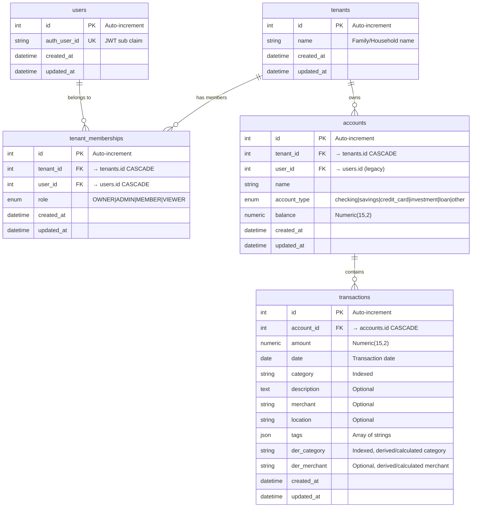

# Database Schema Documentation

Complete database schema documentation for the Finance Planner multi-tenant personal finance tracking system.

## Overview

The Finance Planner uses a relational database with five core tables designed for multi-tenant operation with role-based access control. All data is isolated by tenant (family/household), with automatic cascade deletes to maintain referential integrity.

**Technology Stack:**
- **Database**: PostgreSQL (production) or SQLite (development/testing)
- **ORM**: SQLAlchemy 2.0 with declarative mapping
- **Migrations**: Alembic
- **Multi-Tenancy**: Tenant-scoped data with strict isolation between tenant groups
- **Authorization**: Role-based access control (OWNER, ADMIN, MEMBER, VIEWER)

**Key Features:**
- Auto-timestamping on all records (created_at, updated_at)
- Cascade delete relationships (Tenant → Memberships/Accounts → Transactions)
- Role-based permissions with hierarchical access levels
- Financial precision with Numeric(15,2) for monetary values
- Optimized indexes for common query patterns
- Flexible tagging system using JSON

---

## Entity Relationship Diagram

### ASCII Diagram

```
┌─────────────────────────┐
│        tenants          │
├─────────────────────────┤
│ PK │ id                 │
│    │ name               │◄────── Family/Household name
│    │ created_at         │
│    │ updated_at         │
└──┬────────────┬─────────┘
   │ 1          │ 1
   │            │
   │            │ has many
   │            │
   │ N          │ N
┌──▼─────────────────────┐      ┌──▼──────────────────────┐
│  tenant_memberships    │      │       accounts          │
├────────────────────────┤      ├─────────────────────────┤
│ PK │ id                │      │ PK │ id                 │
│ FK │ tenant_id         │──┐   │ FK │ tenant_id          │───► tenants.id (CASCADE)
│ FK │ user_id           │─►│   │ FK │ user_id            │───► users.id (legacy)
│ IDX│ (tenant_id, user_id)│ │  │ IDX│ tenant_id          │◄─── Multi-tenant queries
│    │ role              │  │   │    │ name               │
│    │ created_at        │  │   │    │ account_type       │◄─── ENUM (checking, savings, etc.)
│    │ updated_at        │  │   │    │ balance            │◄─── Numeric(15,2)
└────────┬───────────────┘  │   │    │ created_at         │
         │                  │   │    │ updated_at         │
         │ N                │   └──────────┬──────────────┘
         │                  │              │ 1
         │                  │              │
         │                  │              │ has many
┌────────▼──────────────┐  │              │
│        users          │  │              │ N
├───────────────────────┤  │   ┌──────────▼──────────────┐
│ PK │ id               │◄─┘   │     transactions        │
│ UK │ auth_user_id     │◄──── JWT 'sub' claim from MCP_Auth
│    │ created_at       │      ├─────────────────────────┤
│    │ updated_at       │      │ PK │ id                 │
└───────────────────────┘      │ FK │ account_id         │───────► accounts.id (CASCADE)
                               │ IDX│ date               │
                               │ IDX│ category           │
                               │    │ amount             │◄────── Numeric(15,2) (+income/-expense)
                               │    │ description        │
                               │    │ merchant           │
                               │    │ location           │
                               │    │ tags               │◄────── JSON array
                               │ IDX│ der_category       │◄────── Derived/calculated category
                               │    │ der_merchant       │◄────── Derived/calculated merchant
                               │    │ created_at         │
                               │    │ updated_at         │
                               └─────────────────────────┘

Composite Indexes:
  • tenant_memberships (tenant_id, user_id) - Unique membership lookup
  • transactions (account_id, date)         - Date range queries per account
  • transactions (account_id, category)     - Category filtering per account
  • transactions (account_id, der_category) - Derived category filtering per account

Multi-Tenant Isolation:
  • Tenant = Isolation boundary (not User)
  • All accounts belong to a tenant (shared within family/household)
  • Users access data through TenantMembership with role-based permissions
  • JWT contains tenant_id claim for authorization
```

### Mermaid Diagram



---

## Table Specifications

### `tenants` Table

**Purpose:** Represents isolation boundaries for multi-tenant architecture. Each tenant is a family/household with shared financial data.

**File:** `app/models/tenant.py`

#### Columns

| Column | Type | Constraints | Description |
|--------|------|-------------|-------------|
| `id` | Integer | PRIMARY KEY, AUTOINCREMENT | Tenant ID |
| `name` | String(255) | NOT NULL | Tenant name (e.g., "Smith Family", "Acme Corporation") |
| `created_at` | DateTime | NOT NULL, DEFAULT now() | Record creation timestamp (from TimestampMixin) |
| `updated_at` | DateTime | NOT NULL, DEFAULT now(), ON UPDATE now() | Last update timestamp (from TimestampMixin) |

#### Relationships

| Relationship | Type | Target | Cascade | Back-Populates |
|--------------|------|--------|---------|----------------|
| `memberships` | One-to-Many | `tenant_memberships` table | `all, delete-orphan` | `tenant_membership.tenant` |
| `accounts` | One-to-Many | `accounts` table | `all, delete-orphan` | `account.tenant` |

**Cascade Behavior:** When a tenant is deleted, all associated memberships and accounts (and their transactions) are automatically deleted.

#### Indexes

- **PRIMARY KEY** on `id`

#### Notes

- Tenant is the isolation boundary for all financial data
- All members of a tenant share the same accounts and transactions
- Complete data isolation between different tenants
- Tenants are created during user registration in MCP_Auth

---

### `tenant_memberships` Table

**Purpose:** Links users to tenants with role-based permissions. Controls who can access tenant data and what they can do.

**File:** `app/models/tenant_membership.py`

#### Columns

| Column | Type | Constraints | Description |
|--------|------|-------------|-------------|
| `id` | Integer | PRIMARY KEY, AUTOINCREMENT | Membership ID |
| `tenant_id` | Integer | FOREIGN KEY (tenants.id), NOT NULL, INDEXED | Tenant this membership belongs to (CASCADE on delete) |
| `user_id` | Integer | FOREIGN KEY (users.id), NOT NULL, INDEXED | User who is a member (CASCADE on delete) |
| `role` | Enum(TenantRole) | NOT NULL, DEFAULT 'member' | Permission level (OWNER, ADMIN, MEMBER, VIEWER) |
| `created_at` | DateTime | NOT NULL, DEFAULT now() | Record creation timestamp (from TimestampMixin) |
| `updated_at` | DateTime | NOT NULL, DEFAULT now(), ON UPDATE now() | Last update timestamp (from TimestampMixin) |

#### Relationships

| Relationship | Type | Target | Cascade | Back-Populates |
|--------------|------|--------|---------|----------------|
| `tenant` | Many-to-One | `tenants` table | N/A (child) | `tenant.memberships` |
| `user` | Many-to-One | `users` table | N/A (child) | `user.memberships` |

**Cascade Behavior:**
- When a tenant is deleted → all memberships deleted (via `tenant.memberships` cascade)
- When a user is deleted → all memberships deleted (via `user.memberships` cascade)

#### Indexes

- **PRIMARY KEY** on `id`
- **UNIQUE INDEX** on `(tenant_id, user_id)` - Prevents duplicate memberships
- **INDEX** on `tenant_id` (for listing tenant members)
- **INDEX** on `user_id` (for finding user's tenants)

#### Foreign Keys

- `tenant_id` → `tenants.id` with `ON DELETE CASCADE`
- `user_id` → `users.id` with `ON DELETE CASCADE`

#### Notes

- Each user can belong to multiple tenants (e.g., family and business)
- Each tenant can have multiple members
- Role hierarchy: OWNER > ADMIN > MEMBER > VIEWER
- OWNER role cannot be changed or removed
- Unique constraint prevents duplicate memberships

---

### `users` Table

**Purpose:** Tracks users authenticated via MCP_Auth JWT tokens. No authentication credentials stored.

**File:** `app/models/user.py`

#### Columns

| Column | Type | Constraints | Description |
|--------|------|-------------|-------------|
| `id` | Integer | PRIMARY KEY, AUTOINCREMENT | Internal user ID |
| `auth_user_id` | String(255) | UNIQUE, NOT NULL, INDEXED | User ID from JWT 'sub' claim (from MCP_Auth) |
| `created_at` | DateTime | NOT NULL, DEFAULT now() | Record creation timestamp (from TimestampMixin) |
| `updated_at` | DateTime | NOT NULL, DEFAULT now(), ON UPDATE now() | Last update timestamp (from TimestampMixin) |

#### Relationships

| Relationship | Type | Target | Cascade | Back-Populates |
|--------------|------|--------|---------|----------------|
| `memberships` | One-to-Many | `tenant_memberships` table | `all, delete-orphan` | `tenant_membership.user` |
| `accounts` | One-to-Many | `accounts` table | `all, delete-orphan` | `account.user` |

**Cascade Behavior:**
- When a user is deleted, all associated memberships are automatically deleted
- When a user is deleted, all associated accounts (and their transactions) are automatically deleted (legacy behavior)

#### Indexes

- **PRIMARY KEY** on `id`
- **UNIQUE INDEX** on `auth_user_id` (also enables fast JWT lookups)

#### Notes

- Users are auto-created on first API request with valid JWT
- No password or email stored (delegated to MCP_Auth)
- `auth_user_id` matches the JWT 'sub' claim from MCP_Auth
- Users access data through TenantMembership with role-based permissions
- A user can belong to multiple tenants (e.g., family and business accounts)

---

### `accounts` Table

**Purpose:** Financial accounts owned by tenants (checking, savings, credit cards, investments, etc.). Shared by all members of a tenant.

**File:** `app/models/account.py`

#### Columns

| Column | Type | Constraints | Description |
|--------|------|-------------|-------------|
| `id` | Integer | PRIMARY KEY, AUTOINCREMENT | Account ID |
| `tenant_id` | Integer | FOREIGN KEY (tenants.id), NOT NULL, INDEXED | Tenant who owns this account (CASCADE on delete) |
| `user_id` | Integer | FOREIGN KEY (users.id), NOT NULL, INDEXED | User who created the account (legacy, for audit trail) |
| `name` | String(255) | NOT NULL | Account name (e.g., "Chase Checking") |
| `account_type` | Enum | NOT NULL | Type of account (see AccountType enum) |
| `balance` | Numeric(15,2) | NOT NULL, DEFAULT 0.00 | Current balance (auto-calculated from transactions) |
| `created_at` | DateTime | NOT NULL, DEFAULT now() | Record creation timestamp (from TimestampMixin) |
| `updated_at` | DateTime | NOT NULL, DEFAULT now(), ON UPDATE now() | Last update timestamp (from TimestampMixin) |

#### Relationships

| Relationship | Type | Target | Cascade | Back-Populates |
|--------------|------|--------|---------|----------------|
| `tenant` | Many-to-One | `tenants` table | N/A (child) | `tenant.accounts` |
| `user` | Many-to-One | `users` table | N/A (child) | `user.accounts` |
| `transactions` | One-to-Many | `transactions` table | `all, delete-orphan` | `transaction.account` |

**Cascade Behavior:**
- When a tenant is deleted → all accounts deleted (via `tenant.accounts` cascade)
- When a user is deleted → all accounts deleted (via `users.accounts` cascade - legacy)
- When an account is deleted → all associated transactions deleted

#### Indexes

- **PRIMARY KEY** on `id`
- **INDEX** on `tenant_id` (critical for multi-tenant queries)
- **INDEX** on `user_id` (for audit trail queries)

#### Foreign Keys

- `tenant_id` → `tenants.id` with `ON DELETE CASCADE`
- `user_id` → `users.id` with `ON DELETE CASCADE`

#### Notes

- Balance is maintained by the transaction service (not directly modified via API)
- All queries must filter by `tenant_id` for multi-tenant security
- All members of a tenant can view and manage all tenant accounts
- Balance precision: Up to 9,999,999,999,999.99 (13 digits + 2 decimals)
- `user_id` is kept for audit trail (who created the account) but is not used for access control

---

### `transactions` Table

**Purpose:** Financial transactions (income, expenses) linked to accounts with automatic balance updates

**File:** `app/models/transaction.py`

#### Columns

| Column | Type | Constraints | Description |
|--------|------|-------------|-------------|
| `id` | Integer | PRIMARY KEY, AUTOINCREMENT | Transaction ID |
| `account_id` | Integer | FOREIGN KEY (accounts.id), NOT NULL, INDEXED | Associated account (CASCADE on delete) |
| `amount` | Numeric(15,2) | NOT NULL | Transaction amount (positive=income, negative=expense) |
| `date` | Date | NOT NULL, INDEXED | Transaction date |
| `category` | String(100) | NOT NULL, INDEXED | Transaction category (e.g., "groceries", "salary") |
| `description` | Text | NULLABLE | Optional detailed description |
| `merchant` | String(255) | NULLABLE | Optional merchant name (e.g., "Whole Foods") |
| `location` | String(255) | NULLABLE | Optional location (e.g., "Seattle, WA") |
| `tags` | JSON | NULLABLE, DEFAULT [] | Array of string tags for flexible categorization |
| `der_category` | String(100) | NULLABLE, INDEXED | Derived/calculated category (from ML/AI, manual overrides, or normalized values) |
| `der_merchant` | String(255) | NULLABLE | Derived/calculated merchant (from ML/AI, manual overrides, or normalized values) |
| `created_at` | DateTime | NOT NULL, DEFAULT now() | Record creation timestamp (from TimestampMixin) |
| `updated_at` | DateTime | NOT NULL, DEFAULT now(), ON UPDATE now() | Last update timestamp (from TimestampMixin) |

#### Relationships

| Relationship | Type | Target | Cascade | Back-Populates |
|--------------|------|--------|---------|----------------|
| `account` | Many-to-One | `accounts` table | N/A (child) | `account.transactions` |

**Cascade Behavior:**
- When an account is deleted → all transactions deleted (via `account.transactions` cascade)

#### Indexes

**Single-Column Indexes:**
- **PRIMARY KEY** on `id`
- **INDEX** on `account_id` (required for FK constraint)
- **INDEX** on `date` (enables efficient date range queries)
- **INDEX** on `category` (enables fast category filtering)
- **INDEX** on `der_category` (enables fast derived category filtering)

**Composite Indexes:**
- **INDEX** `ix_transactions_account_date` on (`account_id`, `date`) - Optimizes date range queries per account
- **INDEX** `ix_transactions_account_category` on (`account_id`, `category`) - Optimizes category filtering per account
- **INDEX** `ix_transactions_account_der_category` on (`account_id`, `der_category`) - Optimizes derived category filtering per account

#### Foreign Keys

- `account_id` → `accounts.id` with `ON DELETE CASCADE`

#### Notes

- Amount convention: Positive = income/deposit, Negative = expense/withdrawal
- Tags stored as JSON array for flexibility (e.g., `["food", "essentials"]`)
- Composite indexes optimize common query patterns (date ranges and category filters per account)
- Creating/updating/deleting transactions automatically recalculates account balance

---

## Enums and Custom Types

### `TenantRole` Enum

**File:** `app/models/role.py`

**Implementation:** Python Enum with SQLAlchemy Enum type (`native_enum=False` for portability)

**Values:**

| Value | Description | Permission Level |
|-------|-------------|------------------|
| `owner` | Full control over tenant - manage members, change roles, update tenant settings, all data operations | Highest (4) |
| `admin` | Invite/remove members, all data operations | High (3) |
| `member` | Create, edit, and delete accounts & transactions | Medium (2) |
| `viewer` | Read-only access to all data | Low (1) |

**Role Hierarchy:**
```
OWNER (4) > ADMIN (3) > MEMBER (2) > VIEWER (1)
```

**Permission Matrix:**

| Action | OWNER | ADMIN | MEMBER | VIEWER |
|--------|-------|-------|--------|--------|
| View accounts & transactions | ✅ | ✅ | ✅ | ✅ |
| Create accounts | ✅ | ✅ | ✅ | ❌ |
| Edit/delete accounts | ✅ | ✅ | ✅ | ❌ |
| Create transactions | ✅ | ✅ | ✅ | ❌ |
| Edit/delete transactions | ✅ | ✅ | ✅ | ❌ |
| Invite members | ✅ | ✅ | ❌ | ❌ |
| Remove members | ✅ | ✅ | ❌ | ❌ |
| Change member roles | ✅ | ❌ | ❌ | ❌ |
| Update tenant name | ✅ | ❌ | ❌ | ❌ |

**Usage Example:**
```python
from app.models.role import TenantRole

membership.role = TenantRole.MEMBER
if context.has_permission(TenantRole.MEMBER):
    # User can create accounts
    pass
```

**Database Storage:** Stored as string values (not native database enum) for portability across PostgreSQL and SQLite.

**Notes:**
- OWNER role cannot be changed or removed
- Role hierarchy enforced in TenantContext.has_permission() method
- Default role for new members is MEMBER

---

### `AccountType` Enum

**File:** `app/models/account.py`

**Implementation:** Python Enum with SQLAlchemy Enum type (`native_enum=False` for portability)

**Values:**

| Value | Description |
|-------|-------------|
| `checking` | Checking account |
| `savings` | Savings account |
| `credit_card` | Credit card account |
| `investment` | Investment/brokerage account |
| `loan` | Loan account |
| `other` | Other account types |

**Usage Example:**
```python
from app.models.account import AccountType

account.account_type = AccountType.CHECKING
```

**Database Storage:** Stored as string values (not native database enum) for portability across PostgreSQL and SQLite.

---

### JSON Fields

#### `transactions.tags`

**Type:** JSON array of strings

**Default:** `[]` (empty array)

**Purpose:** Flexible tagging system without requiring separate tag tables or schema changes

**Structure:**
```json
["food", "essentials", "weekly"]
```

**Usage Example:**
```python
# Creating transaction with tags
transaction.tags = ["groceries", "food", "essentials"]

# Querying (SQLite uses LIKE, PostgreSQL can use @> operator)
# Handled in repository layer
```

**Benefits:**
- No additional tables needed
- Flexible categorization beyond single category field
- Easy to filter (any tag matches)
- JSON queryable in both PostgreSQL and SQLite

---

## Relationships and Cascades

### Relationship Hierarchy

```
Tenant (1) ──┬──► TenantMemberships (Many) ──► Users (Many)
             │
             └──► Accounts (Many) ──────► Transactions (Many)
```

**Multi-Tenant Isolation:**
- Tenant is the top-level isolation boundary
- Users access tenant data through TenantMembership with roles
- All accounts belong to a tenant (shared within family/household)
- Transactions inherit tenant scope through accounts

### Cascade Delete Behavior

#### Tenant Deletion

```
DELETE tenant
  ├─► CASCADE DELETE all memberships
  └─► CASCADE DELETE all accounts
      └─► CASCADE DELETE all transactions
```

**Implementation:**
- `Tenant.memberships` relationship with `cascade="all, delete-orphan"`
- `Tenant.accounts` relationship with `cascade="all, delete-orphan"`

**Effect:** Deleting a tenant removes all memberships, accounts, and transactions. Users remain (they may belong to other tenants).

#### User Deletion

```
DELETE user
  └─► CASCADE DELETE all memberships
```

**Implementation:** `User.memberships` relationship with `cascade="all, delete-orphan"`

**Effect:** Deleting a user removes all their tenant memberships. Accounts and transactions remain (they belong to tenants, not users).

#### Account Deletion

```
DELETE account
  └─► CASCADE DELETE all transactions
```

**Implementation:** `Account.transactions` relationship with `cascade="all, delete-orphan"`

**Effect:** Deleting an account removes all associated transactions.

### Back-Population

**Tenant ↔ TenantMembership:**
- `tenant.memberships` → List of TenantMembership objects
- `tenant_membership.tenant` → Single Tenant object

**User ↔ TenantMembership:**
- `user.memberships` → List of TenantMembership objects
- `tenant_membership.user` → Single User object

**Tenant ↔ Account:**
- `tenant.accounts` → List of Account objects
- `account.tenant` → Single Tenant object

**User ↔ Account:**
- `user.accounts` → List of Account objects (legacy, for audit trail)
- `account.user` → Single User object (who created the account)

**Account ↔ Transaction:**
- `account.transactions` → List of Transaction objects
- `transaction.account` → Single Account object

**Benefits:**
- Bidirectional navigation
- Automatic relationship management by SQLAlchemy
- Cascade deletes maintain referential integrity
- Multi-tenant isolation enforced at database level

---

## Indexes

### Purpose and Performance Impact

Indexes dramatically improve query performance for common operations in the Finance Planner.

### Index Summary

| Table | Column(s) | Type | Purpose |
|-------|-----------|------|---------|
| `tenants` | `id` | PRIMARY KEY | Unique tenant identification |
| `tenant_memberships` | `id` | PRIMARY KEY | Unique membership identification |
| `tenant_memberships` | `(tenant_id, user_id)` | UNIQUE INDEX | Prevent duplicate memberships, fast lookups |
| `tenant_memberships` | `tenant_id` | INDEX | List all members of a tenant |
| `tenant_memberships` | `user_id` | INDEX | Find all tenants for a user |
| `users` | `id` | PRIMARY KEY | Unique user identification |
| `users` | `auth_user_id` | UNIQUE INDEX | Fast JWT user lookups, prevent duplicates |
| `accounts` | `id` | PRIMARY KEY | Unique account identification |
| `accounts` | `tenant_id` | INDEX | Multi-tenant queries (critical!) |
| `accounts` | `user_id` | INDEX | Audit trail queries |
| `transactions` | `id` | PRIMARY KEY | Unique transaction identification |
| `transactions` | `account_id` | INDEX | FK constraint + transaction filtering |
| `transactions` | `date` | INDEX | Date range queries |
| `transactions` | `category` | INDEX | Category filtering |
| `transactions` | `der_category` | INDEX | Derived category filtering |
| `transactions` | `(account_id, date)` | COMPOSITE INDEX | Date range queries per account |
| `transactions` | `(account_id, category)` | COMPOSITE INDEX | Category filtering per account |
| `transactions` | `(account_id, der_category)` | COMPOSITE INDEX | Derived category filtering per account |

### Composite Index Details

#### `ix_transactions_account_date` (account_id, date)

**Optimizes:**
```sql
SELECT * FROM transactions
WHERE account_id = ? AND date BETWEEN ? AND ?
ORDER BY date DESC;
```

**Use Case:** Fetching transactions for a specific account within a date range (very common)

#### `ix_transactions_account_category` (account_id, category)

**Optimizes:**
```sql
SELECT * FROM transactions
WHERE account_id = ? AND category = ?;
```

**Use Case:** Viewing all transactions of a specific category for an account (e.g., "groceries")

### Multi-Tenant Index Strategy

The `tenant_id` index on the `accounts` table is **critical** for multi-tenant performance:

```sql
-- Fast query (uses index):
SELECT * FROM accounts WHERE tenant_id = 5;

-- Without index, this would be a full table scan across all tenants!
```

Every account query is scoped by `tenant_id` to enforce tenant isolation. The unique composite index on `tenant_memberships (tenant_id, user_id)` ensures fast authorization checks when verifying user permissions.

---

## Design Decisions

### 1. Multi-Tenant Isolation

**Decision:** Enforce tenant isolation at the repository layer using `tenant_id` filters on every query. Users access data through TenantMembership with role-based permissions.

**Rationale:**
- Prevents data leaks between tenant groups (families/households)
- Enables collaboration within tenant (all members share accounts)
- Returns 404 (not 403) when accessing other tenants' data to avoid revealing existence
- Index on `tenant_id` ensures performant filtering
- TenantMembership provides fine-grained access control with roles

**Implementation:**
- All repository methods filter by `tenant_id` extracted from JWT token
- TenantContext verifies user membership and role before operations
- Permission checks at service layer based on role hierarchy

---

### 2. Cascade Deletes

**Decision:** Use SQLAlchemy cascade deletes (`cascade="all, delete-orphan"`)

**Rationale:**
- Automatic cleanup prevents orphaned records
- Maintains referential integrity
- Simplifies application logic (no manual cleanup needed)

**Trade-off:** No "soft delete" - deletions are permanent. Consider adding `deleted_at` field if soft deletes needed.

---

### 3. Numeric Precision for Money

**Decision:** Use `Numeric(15, 2)` for all monetary values (`balance`, `amount`)

**Rationale:**
- Exact decimal representation (no floating-point errors)
- 15 total digits, 2 decimal places = up to $9,999,999,999,999.99
- Industry standard for financial applications

**Alternatives Rejected:**
- `Float` - Rounding errors in financial calculations (unacceptable)
- `Integer` (cents) - Requires conversion logic, less readable

---

### 4. Timestamp Audit Trail

**Decision:** Add `created_at` and `updated_at` to all tables via `TimestampMixin`

**Rationale:**
- Audit trail for all records
- Server-side timestamps prevent client manipulation
- Useful for debugging, analytics, and compliance

**Implementation:** Server-side default `func.now()` with automatic `onupdate` for `updated_at`.

---

### 5. JSON Tags vs. Separate Tag Table

**Decision:** Store tags as JSON array in `transactions.tags` field

**Rationale:**
- **Flexibility:** No schema changes needed to add new tags
- **Simplicity:** No join tables or tag management required
- **Performance:** JSON queryable in both PostgreSQL and SQLite
- **Overhead:** Low - most transactions have 0-5 tags

**Alternatives Rejected:**
- Separate `tags` table with many-to-many relationship - Over-engineering for simple tagging

---

### 6. Account Type Enum

**Decision:** Use Python Enum + SQLAlchemy Enum type with `native_enum=False`

**Rationale:**
- Type safety in Python code
- Prevents invalid values at database level
- `native_enum=False` ensures portability (SQLite doesn't have native enums)

**Values Chosen:** Common account types (checking, savings, credit_card, investment, loan, other)

---

### 7. Balance as Calculated Field

**Decision:** Store `balance` in accounts table, updated by transaction service

**Rationale:**
- **Performance:** Instant balance retrieval (no SUM aggregation on every query)
- **Consistency:** Service layer ensures atomic updates with transactions
- **Accuracy:** All balance changes go through service layer validation

**Trade-off:** Requires careful service layer implementation to maintain consistency.

---

### 8. Composite Indexes

**Decision:** Add composite indexes on `(account_id, date)` and `(account_id, category)`

**Rationale:**
- Common query patterns: "Show transactions for this account by date" and "Show groceries for this account"
- Composite indexes eliminate need for separate single-column indexes
- Significant performance improvement for filtered queries

**Cost:** Slightly slower inserts (negligible for typical transaction volume)

---

## Schema Management

### Alembic Migrations

**Location:** `alembic/versions/`

**Initial Migration:** Creates all three tables with relationships and indexes

**View Current Schema:**

**PostgreSQL:**
```bash
psql finance_planner

\dt                    # List tables
\d users              # Describe users table
\d accounts           # Describe accounts table
\d transactions       # Describe transactions table
```

**SQLite:**
```bash
sqlite3 finance_planner.db

.tables               # List tables
.schema users         # Show users table schema
.schema accounts      # Show accounts table schema
.schema transactions  # Show transactions table schema
```

### Running Migrations

**Apply all pending migrations:**
```bash
alembic upgrade head
```

**Create new migration after model changes:**
```bash
alembic revision --autogenerate -m "Description of changes"
```

**Rollback last migration:**
```bash
alembic downgrade -1
```

**View migration history:**
```bash
alembic history
```

### Model Files

| Table | Model File |
|-------|------------|
| `tenants` | `app/models/tenant.py` |
| `tenant_memberships` | `app/models/tenant_membership.py` |
| `users` | `app/models/user.py` |
| `accounts` | `app/models/account.py` |
| `transactions` | `app/models/transaction.py` |
| Enums | `app/models/role.py`, `app/models/account.py` |
| Context | `app/models/tenant_context.py` |
| Base classes | `app/models/base.py` |

### Schema Verification

After running migrations, verify the schema matches this documentation:

1. **Check tables exist:**
   ```sql
   SELECT table_name FROM information_schema.tables
   WHERE table_schema = 'public';
   ```

2. **Verify foreign keys:**
   ```sql
   SELECT constraint_name, table_name, column_name,
          foreign_table_name, foreign_column_name
   FROM information_schema.key_column_usage
   WHERE table_schema = 'public';
   ```

3. **Check indexes:**
   ```sql
   SELECT tablename, indexname, indexdef
   FROM pg_indexes
   WHERE schemaname = 'public';
   ```

---

## Summary

The Finance Planner database schema is designed for:

✅ **Multi-tenant security** - Strict tenant isolation with role-based access control
✅ **Collaboration** - Family/household members share accounts within tenant
✅ **Data integrity** - Cascade deletes and foreign keys
✅ **Performance** - Strategic indexes for common queries
✅ **Accuracy** - Numeric precision for financial data
✅ **Auditability** - Timestamps on all records
✅ **Flexibility** - JSON tags and comprehensive account types
✅ **Authorization** - Four-tier role hierarchy (OWNER > ADMIN > MEMBER > VIEWER)
✅ **Maintainability** - Clear relationships and well-documented design

**Architecture:**
- **Total Tables:** 5 (tenants, tenant_memberships, users, accounts, transactions)
- **Total Indexes:** 18 (including composite indexes)
- **Relationships:** 5 (Tenant→Memberships, Tenant→Accounts, User→Memberships, User→Accounts, Account→Transactions)
- **Isolation Boundary:** Tenant (not User)
- **Technology:** SQLAlchemy 2.0 + Alembic + PostgreSQL/SQLite

**Multi-Tenant Features:**
- Complete data isolation between tenant groups
- Shared accounts and transactions within tenant
- Role-based permissions enforced at service layer
- JWT token contains tenant_id for authorization
- Users can belong to multiple tenants